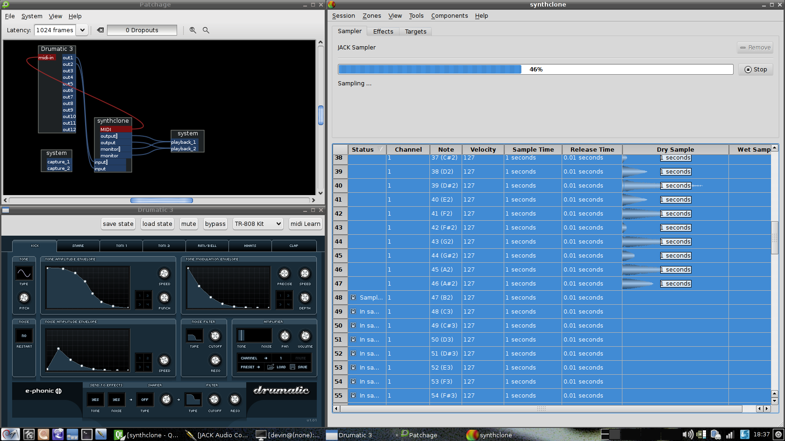
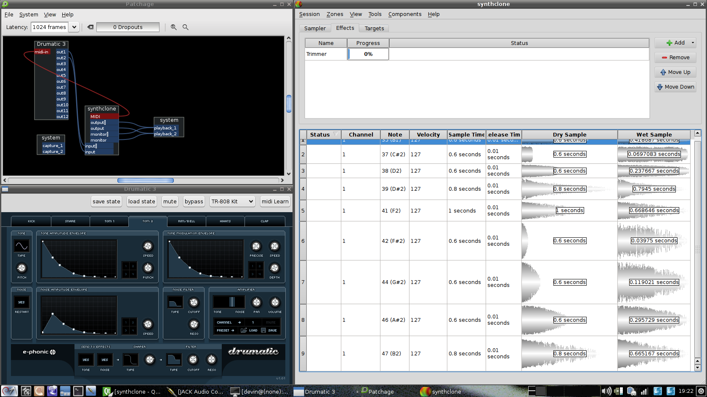

# synthclone #

`synthclone` is a Qt-based application that can "clone" your MIDI-capable
instruments.  It does this by sending out MIDI data that instructs an
instrument to emit sounds for a series of notes and velocities.  It then saves
this data as a sample-based instrument that can be loaded by sampler software.

For more information on `synthclone`, visit:

  http://synthclone.googlecode.com/

The googlecode.com URL is 404, but there is:

  https://github.com/surfacepatterns/synthclone

All images, save for application logos, are taken from the excellent Oxygen
Icon Theme.  For more information on the Oxygen Icon Theme, visit:

  http://www.oxygen-icons.org/

## What is 'synthclone'? ##

> _synthclone_ is a tool that allows you to create sample-based instruments.  You can create sample-based instruments by sending MIDI messages to your MIDI-capable gear or software that instructs an instrument to emit sounds for a series of notes, velocities, controls, and aftertouch values, or by recording your own samples.  After the sampling is done, you can apply effects to your samples, and finally save this data as a sample-based instrument that can be loaded by sampler software.

> _synthclone_ is free, open-source software, distributed under a dual-license model.  The plugin API and the API implementation (libsynthclone) are distributed under the terms of the [GNU Lesser General Public License](http://www.gnu.org/licenses/lgpl-2.1.html).  The application, plugins, and everything else comprising `synthclone` are distributed under the terms of the [GNU General Public License](http://www.gnu.org/licenses/old-licenses/gpl-2.0.html).

## Screenshots ##

> Here are two screenshots of `synthclone` sampling a drum kit synthesized using the [Drumatic VST](http://www.e-phonic.com/plugins/drumatic3.php):

> 

> 

> ... and [this](http://synthclone.googlecode.com/files/Noisy%20Kit.h2drumkit) is the resulting [Hydrogen](http://www.hydrogen-music.org) drum kit, after using Hydrogen to rename the instruments and set mute groups for the hi-hats.  It's noisy, distorted, and public domain.  That's how I like my drum kits.

## Features ##

  * Supports user-configurable per-zone sample time, release time, MIDI note, MIDI velocity, MIDI aftertouch, MIDI channel pressure, MIDI control changes, etc. via a table interface.
  * Audition samples and change zone parameters until you're happy with the data you're acquiring from your MIDI device.
  * Save and restore sessions.
  * Distributed with plugins that support the JACK Audio Connection Kit (with JACK Session support), PortAudio and PortMidi, trimming of samples, reversing samples, LV2 effects, the creation of Hydrogen, SFZ, and Renoise instruments, automated zone generation, and loading samples from your local filesystem!
  * Can create multiple targets in one session (i.e. a Renoise patch and an SFZ patch) from the same set of samples.
  * A [well-documented plugin API](http://wiki.synthclone.googlecode.com/git/doxygen/index.html) is available for developers to write their own plugins to extend _synthclone_.

## Requirements ##

  * [Qt5](https://en.wikipedia.org/wiki/Qt_(software))
  * [libsndfile](http://www.mega-nerd.com/libsndfile/)
  * [libsamplerate](http://www.mega-nerd.com/SRC/)
  * [PortAudio](http://www.portaudio.com/) and [PortMidi](http://portmedia.sourceforge.net/portmidi/) (to use the PortMedia sampler plugin)
  * [JACK Audio Connection Kit](http://www.jackaudio.org/) (to use the JACK sampler plugin)
  * [libarchive](https://libarchive.org/) (to use the Hydrogen plugin)
  * [Lilv](http://drobilla.net/software/lilv.html) and [Suil](http://drobilla.net/software/suil.html) (to use the LV2 effect plugin)
  * [libzip](http://www.nih.at/libzip/) (to use the Renoise plugin)

## Downloads ##

> _Latest Release_: December 20, 2012 - [synthclone-0.3.0.tar.gz](http://synthclone.googlecode.com/files/synthclone-0.3.0.tar.gz)

> This release includes four new plugins:

  * lv2: Use LV2 effects inside synthclone.
  * renoise: Save your instruments as Renoise instruments.
  * reverser: A new reverser effect that reverses what you sample.
  * sampleloader: Now, you can load samples into synthclone from your local filesystem.

> Please report bugs using the [issue tracker](http://code.google.com/p/synthclone/issues/list).

## Installation ##

> _synthclone_ currently requires [a Python interpreter](http://www.python.org/), [doxygen](http://www.doxygen.org/), and [qmake from Qt5](https://doc.qt.io/qt-5/qmake-manual.html) for building.  To build the software, execute the commands:

```
  ./configure --prefix=/usr
  make
```

> ... on the command line, optionally replacing '/usr' above with your preferred installation location.  To install the software, execute:

```
  make install
```

## Documentation ##

> Eventually, I'd like to have enough documentation that I wouldn't be able to list it all here.  For now, here it is:

  * [Video Tutorial on `synthclone`](http://vimeo.com/73053302) by Glen MacArthur, the creator of [AVLinux](http://www.bandshed.net/AVLinux.html).
  * There's some documentation on a couple plugins on [the wiki](http://code.google.com/p/synthclone/w/list).
  * [Doxygen-generated documentation for the developer API](http://wiki.synthclone.googlecode.com/git/doxygen/index.html).
  * [Tutorial on Writing Plugins](http://code.google.com/p/synthclone/wiki/TutorialWritingASimplePluginPart1)


> If you're interested in helping by writing documentation, then join the [user group](http://groups.google.com/group/synthclone-users), and send me a message.

## Bugs ##

> Report bugs using the [issue tracker](http://code.google.com/p/synthclone/issues/list).

## Support ##

> Bug reports and feature requests can be filed using the [issue tracker](http://code.google.com/p/synthclone/issues/list).  The software can be discussed through the [synthclone-users Google Group](http://groups.google.com/group/synthclone-users).

## Contributing ##

> There are many ways you can contribute to `synthclone`:

  * If you're a developer and think that `synthclone` is missing a feature or two, you can help by writing plugins that extend the functionality of `synthclone`.  `synthclone` has a [plugin API](http://wiki.synthclone.googlecode.com/git/doxygen/index.html) that allows developers to write their own plugins.
  * If you have a good command of one or more languages, you can help by writing much-needed documentation on `synthclone` and the plugins distributed with `synthclone`, or by translating `synthclone`.
  * If you want to donate to `synthclone`, contact the author.

## Acknowledgements ##

> This page's format was ruthlessly stolen from the [QjackCtl project page](http://qjackctl.sourceforge.net/).

## Contact ##

> Devin Anderson <surfacepatterns (at) gmail (dot) com>

## See also:

 * Qt5 port by Edgar Aichinger: https://github.com/edogawa23/synthclone
 * LADI project modifications: https://gitea.ladish.org/LADI/synthclone
